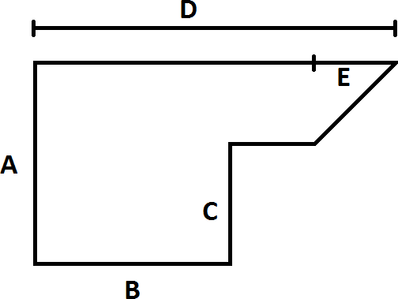

[](https://classroom.github.com/online_ide?assignment_repo_id=3774718&assignment_repo_type=AssignmentRepo)
# RoomAreaStarter

Starter code for a room area program.

Originally by: Edhesive Intro to CS

Modifications by: Alex Wolfe

## Instructions



For this lab, you will find the area of an irregularly shaped room with the shape as shown above.

Ask the user to enter the values for sides A, B, C, D, and E and print out the total room area.

Remember these common formulas for finding area:
*   area of a rectangle is `length * width`
*   area of a right triangle is `0.5 * base * height`.

Please note the final area should be `return`ed in decimal format. (i.e. `float`)


## Requirements
*   On script run, ask user for inputs (should allow `float`s)
*   A main function - `room_area(a,b,c,d,e)`
    *   Accepts parameters for the dimensions of the room.
    *   Calculates the area using the helper functions
    *   Returns the final area to be printed out as a float.
*   Helper functions for each shape you’re calculating the area of.
    *   Each helper function should:
        *   Have parameters for the necessary values.
        *   Have a properly formatted [docstrings](https://www.python.org/dev/peps/pep-0257/).
            *   Your docstring for `room_area()` should explain how you chose to calculate the area of the room (how many squares/triangles and what their dimensions were.)
        *   Return the area as a `float`.
    *   Example functions:
        *   `rectangle_area(length, width)` -  returns the area of the rectangle as a `float`.
        *   `right_triangle_area(base, height)` - returns the area of the triangle as a `float`.


## Sample Run

```
Enter side A: 11
Enter side B: 2
Enter side C: 4
Enter side D: 7
Enter side E: 1
```

## Sample Output

```
Room Area: 53.5
```
